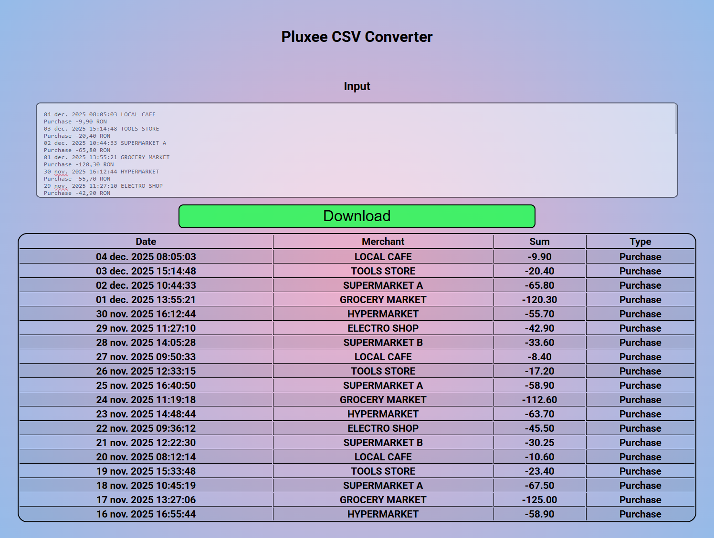

# Pluxee CSV Converter

## English

**Pluxee CSV Converter** is a simple web page that helps you convert your Pluxee transaction data into a CSV file for easy use in spreadsheets.

### How to Use

1. Open the [web page](https://alexthemaster.github.io/pluxee2csv) in your browser.
2. Paste your Pluxee transaction into the text area. (Export to PDF -> Open PDF -> Select all transactions -> Copy -> Paste)
3. The transactions will appear in a table below.
4. Click the **Download** button to save them to a CSV file.

---

## Română

**Pluxee CSV Converter** este o pagină web simplă care te ajută să convertești tranzacțiile tale Pluxee într-un fișier CSV, ușor de folosit în spreadsheet-uri.

### Cum se folosește

1. Deschide [pagina web](https://alexthemaster.github.io/pluxee2csv) în browser.
2. Inserează tranzacțiile tale Pluxee în chenarul pentru text. (Exportă în PDF -> Deschide PDF-ul -> Selectează toate tranzacțiile -> Copy -> Paste)
3. Tranzacțiile vor apărea într-un tabel dedesubt.
4. Apasă pe butonul **Download** pentru a le salva într-un fișier CSV.
